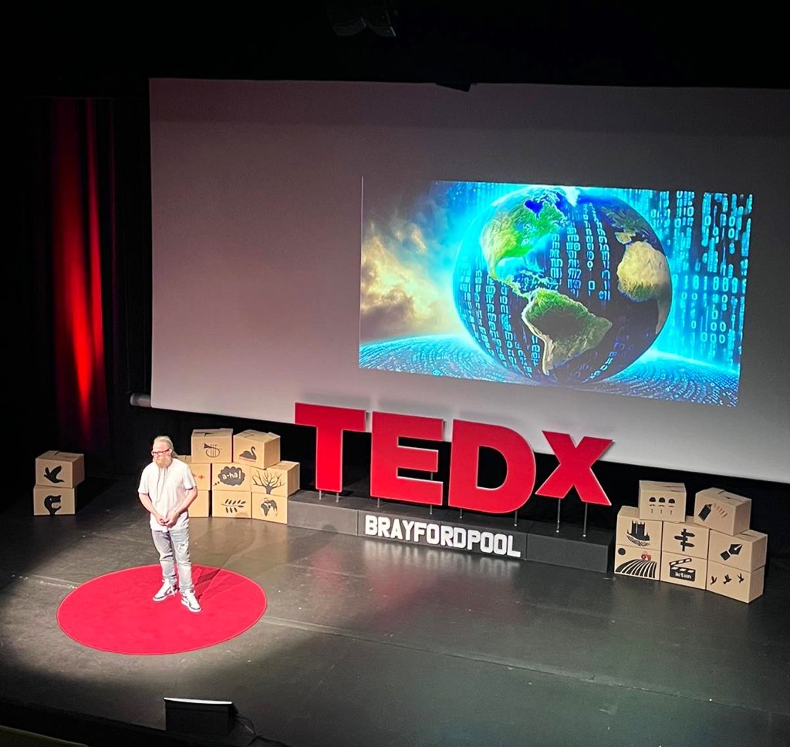

<h1 align="center">Stuart Clark (aka BigEvilBeard)</h1>
<h3 align="center">Senior Developer Advocate</h3>

Stuart is a Senior Developer Advocate |   DevOps Pioneer | TEDx Speaker | International Keynote Speaker | Technical Author | DevNet Expert #2022005
 
Stuart is a sought-after speaker, TEDx presenter, and champion for sustainable software. He's passionate about the impact of software and AI on the climate and empowers developers to build a more sustainable future. As a leading expert in programmability and DevOps, he frequently graces industry stages worldwide, sharing his knowledge and inspiring others. In his previous role as a network engineer, he became obsessed with network automation and became a developer advocate for network automation. He contributed to the Cisco DevNet exams and was part of one of the SME teams which created, designed, and built the Cisco Certified DevNet Expert. He lives in Lincoln, England, with his wife, Natalie, and their son, Maddox. He plays guitar and rocks an impressive two-foot beard while drinking coffee. You can find him on social media @bigevilbeard

  

- **Senior Developer Advocate Spotify Backstage, drinking coffee and playing guitar (not at the same time)**

- Ask me about **Code / Coffee / Guitars / Beards**

- How to reach me **https://bigevilbeard.github.io/**

- Amazon Author profile [Stuart Clark](https://www.amazon.com/~/e/B0B9YQN9CF)

- Order [Cisco Certified DevNet Associate Handbook](https://www.amazon.com/dp/B0CTR59YF5)
- Order [Cisco Certified DevNet Professional DEVCOR 350-901 Official Cert Guide](https://www.ciscopress.com/store/cisco-certified-devnet-professional-devcor-350-901-9780137370443)

<h3 align="left">Connect with me:</h3>

<h3 align="left">Languages and Tools:</h3>

            

