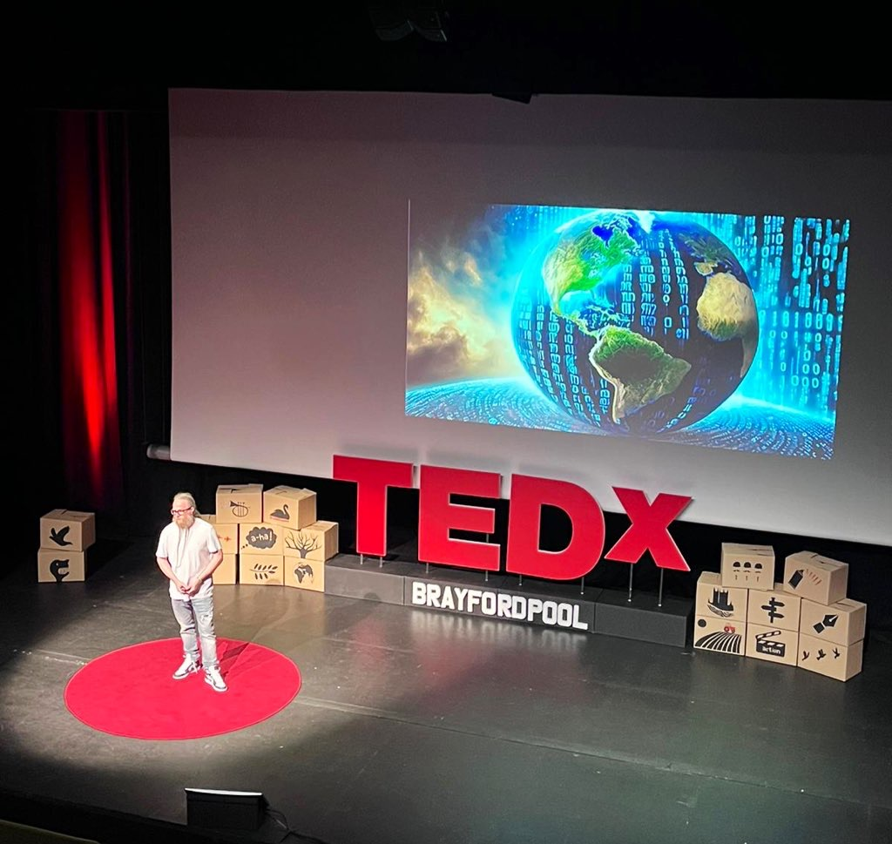

  <h1 align="center">Stuart Clark</h1>
  <h3 align="center">Senior Developer Advocate at Spotify · Backstage & Portal</h3>

  

    
    
    
  

  

    
  

  Senior Technology Leader | DevOps Pioneer | TEDx Speaker | International Keynote Speaker | Technical Author | CCIE# 70062, DEVNET# 20220005

  I work on [Backstage](https://backstage.io), Spotify's open-source developer portal framework. Previously I spent years deep in network automation, and became obsessed with making infrastructure programmable. These days I'm focused on developer experience, sustainable software, and the impact of AI on the climate.

  When I'm not on stage or writing code, I'm drinking coffee and playing guitar — not at the same time.

  ---

  ### What I'm up to

  - 🎤 Speaking about Backstage, developer experience, and sustainable software at conferences worldwide
  - 📚 Author of [Cisco Certified DevNet Associate Handbook](https://www.amazon.com/dp/B0CTR59YF5) [CCNA Automation Handbook: Automating Networks Using Cisco Platforms (200-901 CCNAAUTO) v1.1)](https://amzn.eu/d/0fTXpiji )and [DevNet Professional DEVCOR 350-901 Official Cert
  Guide](https://www.ciscopress.com/store/cisco-certified-devnet-professional-devcor-350-901-9780137370443)
  - 🎥 [YouTube talks & demos](https://www.youtube.com/watch?v=oVQHfc-FcY8&list=PLDqi6CuDzubykc0fhevEDzCHJnIfyPVAO)

  ---

  ### Ask me about

  Code · Coffee · Guitars · Beards · Backstage · Developer portals
  ---

  ### Languages and Tools

  

    
    
    
    
    
    
    
    
    
    
    
  

