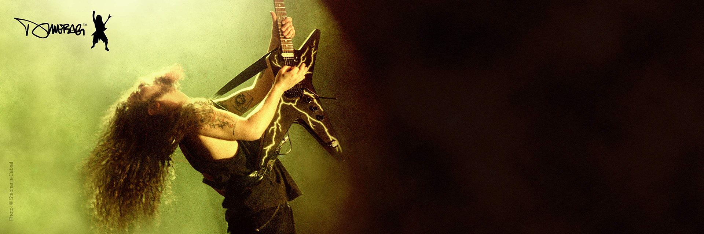

<h1 align="center">Stuart Clark (aka BigEvilBeard)</h1>
<h3 align="center">Senior Developer Advocate For Cisco DevNet</h3>

Stuart is a Senior Technical Leader / Senior Developer Advocate for Cisco Devnet. He has work for Cisco for over ten years designing, building and troubleshooting Cisco’s Security Cloud network with a strong focus on BGP, peering and coffee. In the last few years his focus moved to network automation, spending more time on writing code for network automation at scale and moving networking towards a DevOps methodology.

  

- 🔭 I’m currently working on **Network Automation, drinking coffee and playing guitar (not at the same time)**

- 📝 I regularly write articles on [https://blogs.cisco.com/author/stuartclark](https://blogs.cisco.com/author/stuartclark)

- 💬 Ask me about **Network Automation / Coffee / Guitars / Metal / Beards**

- 📫 How to reach me **stuaclar@cisco.com**

<h3 align="left">Connect with me:</h3>

<h3 align="left">Languages and Tools:</h3>

            

# Blog Posts
<!-- BLOG-POST-LIST:START -->
- [Observability vs. monitoring for DevOps](https://blogs.cisco.com/developer/observabilityvsmonitoringdevops01)
- [Explore Secure DDoS Edge Protection with new Sandbox and Learning Labs](https://blogs.cisco.com/developer/secureedgeprotection01)
- [SD-WAN Sandboxes Get a Refresh](https://blogs.cisco.com/developer/sdwansandboxrefresh01)
- [Using NSO with pyATS Parsers to Check Operational State](https://blogs.cisco.com/developer/nsowithpyatsparsers01)
- [The APIs We’re Experimenting with Over the Holidays](https://blogs.cisco.com/developer/holidayapis01)
<!-- BLOG-POST-LIST:END --> 
